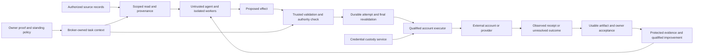

# AgentOS: architecture for powerful agents with bounded authority

Record: PR none · package ARCH1 · head 3c9f9e711be3d394537cb9e6aedc5b4ee394e2c0

**Scope:** Mark-requested first-principles review of the whole architecture, 2026-10-08. Fixed source is the head above. This is a separate synthesis after the security, potency and onboarding reviews. Recommendations are advisory; this PR changes no runtime, SPEC, authority policy or lane. The project describes itself accurately as **pre-alpha, not yet usable by an owner**.

## Judgment

**The central architecture is sound: give agents broad computational freedom while keeping credentials and consequential authority outside their control.** That can increase security and useful capability together. Disposable machines, snapshots and isolated workers make it affordable to try more approaches; a deterministic broker lets the owner delegate bounded outcomes without supervising every tool call.

The main risk is **compositional**. A collection of secure packages is not yet a secure, useful OS. Source access, model routing, approvals, serialization, remote execution, receipts, recovery and learned state must agree about the same task, data and authority. Today that agreement is partly implemented, partly delegated to adapter conventions, and partly waiting on integration. The strongest near-term investment is completing and qualifying those joins, not adding more agent intelligence or another permission layer.

Three architectural priorities follow: precise guarantee contracts; one bound effect from approval to receipt; and a small production qualification profile with one complete useful workflow. Two additional design directions—source-scoped task contexts and provenance through learned artifacts—would support stronger privacy guarantees than the current owner-wide private domain. They require L1 policy decisions; this review does not silently turn them into existing release requirements.

## First principles: what the OS should own

The model proposes work. It does not decide which authority it has, certify where data came from, declare that an external operation is harmless, or grade its own security. The OS should own:

1. **Identity and authority:** owner proof, machine/task identity, grants, revocation and operation limits.
2. **Data movement:** which inputs a context may read and which principals may receive its outputs, including model operators.
3. **Consequential execution:** a verified operation, durable attempt, observed result and honest handling of uncertainty.
4. **Recoverable state and resource bounds:** snapshots, durable task/artifact state, quotas, budgets and model-independent STOP.
5. **Evidence for improvement:** actual accepted outcomes and protected evaluation, separate from permission and transport success.

Planning, code generation, document transformation, exploration and hypotheses should remain outside that trusted decision surface. Keep replaceable guests and generous isolated computation. Avoid moving general reasoning into the broker merely because a verifier cannot understand an arbitrary task. Conversely, containment does not establish semantic correctness: an authorized agent can still write a bad report. [Purpose and interface](https://github.com/ghbmrk/agentOS/blob/3c9f9e711be3d394537cb9e6aedc5b4ee394e2c0/SPEC.md#L36), [OP-7](https://github.com/ghbmrk/agentOS/blob/3c9f9e711be3d394537cb9e6aedc5b4ee394e2c0/SPEC.md#L310), [guest confinement](https://github.com/ghbmrk/agentOS/blob/3c9f9e711be3d394537cb9e6aedc5b4ee394e2c0/broker/vm/gvisor/gvisor.go#L476).

“Reversibility is the trust boundary” is useful shorthand but incomplete. **Confinement and complete mediation are the enforcement boundary; reversibility enlarges what is safe within it.** A filesystem rollback cannot retract a disclosure, refund inference or reverse an arbitrary server action. The spec already treats disclosure separately, and current VM rollback conservatively retains a raised privacy label. [REV-1–5](https://github.com/ghbmrk/agentOS/blob/3c9f9e711be3d394537cb9e6aedc5b4ee394e2c0/SPEC.md#L138), [rollback](https://github.com/ghbmrk/agentOS/blob/3c9f9e711be3d394537cb9e6aedc5b4ee394e2c0/broker/vm/vm.go#L1199).

This is the recommended conceptual contract, **not a claim every arrow is wired**. Model calls are also disclosures/spend with their own checked path. The external service and its semantics remain outside local enforcement.

## Strong foundations worth preserving

- **Structural custody.** Machine identity comes from a per-machine socket, not a guest assertion. The control daemon forwards to a separate custody process; it strips guest `Agentos-*` headers and supplies identity/label. The proxy validates declared requests, reconstructs accepted JSON and injects owner credentials. `apiKeysOnly` prevents selecting an approval seed as an upstream key. These are substantial improvements over an agent holding environment secrets. [Guest identity](https://github.com/ghbmrk/agentOS/blob/3c9f9e711be3d394537cb9e6aedc5b4ee394e2c0/broker/guest/plane.go#L1), [forwarding](https://github.com/ghbmrk/agentOS/blob/3c9f9e711be3d394537cb9e6aedc5b4ee394e2c0/broker/modelroute/modelroute.go#L156), [proxy](https://github.com/ghbmrk/agentOS/blob/3c9f9e711be3d394537cb9e6aedc5b4ee394e2c0/broker/egress/proxy.go#L286), [key kind](https://github.com/ghbmrk/agentOS/blob/3c9f9e711be3d394537cb9e6aedc5b4ee394e2c0/broker/cmd/agentos-egress/custody.go#L839).
- **Durable authority and uncertainty.** The journal records dispatch before execution, rechecks relevant changes and retains unknown outcomes/account fences. This is a better foundation for delegation than retry-until-success. It gives durable attempt identity, not magical exactly-once remote success. [Dispatch](https://github.com/ghbmrk/agentOS/blob/3c9f9e711be3d394537cb9e6aedc5b4ee394e2c0/broker/journal/engine.go#L206), [executor contract](https://github.com/ghbmrk/agentOS/blob/3c9f9e711be3d394537cb9e6aedc5b4ee394e2c0/broker/journal/intent.go#L139).
- **Inference-free control.** STOP, status and policy controls are outside the model; missing optional intelligence need not remove control. Do not couple these to an increasingly complicated planner or learning process. [Daemon contract](https://github.com/ghbmrk/agentOS/blob/3c9f9e711be3d394537cb9e6aedc5b4ee394e2c0/broker/daemon/daemon.go#L1).
- **Useful freedom under confinement.** Unmodified guests, worker root access and fork/test/keep preserve general capability. Workers do not need account credentials merely to manipulate a document or test code. [Worker boundary](https://github.com/ghbmrk/agentOS/blob/3c9f9e711be3d394537cb9e6aedc5b4ee394e2c0/broker/workers/workers.go#L6).
- **Learning does not confer authority.** Hidden evaluation, broker-owned candidate classification and authority-neutral adoption are the right separation. Keep broad authorized task execution available even when automatic quality grading is not qualified for that task class. [Pipeline](https://github.com/ghbmrk/agentOS/blob/3c9f9e711be3d394537cb9e6aedc5b4ee394e2c0/broker/change/pipeline.go#L45), [CHG-6](https://github.com/ghbmrk/agentOS/blob/3c9f9e711be3d394537cb9e6aedc5b4ee394e2c0/SPEC.md#L412).
- **Owner sovereignty.** Local custody, replaceable providers, optional publication and project-independent control reduce dependencies. They have real costs—SMS/voice for remote control, local rich interaction, hardware qualification—that should be treated as explicit product constraints rather than solved with an unapproved relay. [Dependency contract](https://github.com/ghbmrk/agentOS/blob/3c9f9e711be3d394537cb9e6aedc5b4ee394e2c0/SPEC.md#L43).

## Be exact about the guarantees

| Property | What the architecture can establish | What remains trusted, permitted or unproven |
|---|---|---|
| Reusable credentials | A confined ordinary guest cannot directly read broker-held keys; declared requests receive injection at the custody boundary | Host kernel/firmware/hypervisor/broker/executor trusted base; upstream provider receives its credential; browser/CLI readers need explicit treatment |
| Private data | Caller label rises before owner-data reads; destinations and account effects are mediated | `private` is one broad domain, not per-client/project confidentiality; enabled model operators can see their inputs |
| Effects | Policy and durable attempts gate qualified operations | Remote semantic meaning, conditional undo and deduplication require adapter/service evidence |
| Recovery | Broker-held state, tombstones and tested replay can survive interruption | Copying information to other contexts or external recipients creates additional dependencies; source deletion and whole-task FORGET differ |
| Publication | A clean-room builder cannot read private stores directly; only constrained hints cross | Hints deliberately depend on private activity; “zero information leakage” is stronger than the stated mechanism |
| Improvement | Protected evidence can qualify a narrowly defined improvement | Approval, execution success, owner acceptance and learning eligibility are different; library tests do not measure owner benefit |

These are conditional guarantees, not blanket protection against a compromised trusted host or dishonest authorized recipient. CRED-2 explicitly excludes trusted-base compromise. CRED-3 distinguishes secrets encountered as legitimate content from credential custody. Unknown-host tampering is an accepted MVP risk under HW-5a. Those limits should remain visible at the point where the guarantee is claimed. [CRED-1–3](https://github.com/ghbmrk/agentOS/blob/3c9f9e711be3d394537cb9e6aedc5b4ee394e2c0/SPEC.md#L211), [boot assumption](https://github.com/ghbmrk/agentOS/blob/3c9f9e711be3d394537cb9e6aedc5b4ee394e2c0/SPEC.md#L81).

### 1. Resolve the credential-reader trust contract

The browser protocol describes the driver as untrusted, while the gate relies on its snapshots/URL and scans its output. If a process can read a credential and controls arbitrary prose or pixels, pattern matching cannot prevent every encoding of that credential. This is a **threat-model/claim gap**, not a demonstrated production leak: browser part 1 has no sessions, VM integration or complete effect classification, and records those limits. [Protocol wording](https://github.com/ghbmrk/agentOS/blob/3c9f9e711be3d394537cb9e6aedc5b4ee394e2c0/broker/browser/protocol.go#L7), [output checks](https://github.com/ghbmrk/agentOS/blob/3c9f9e711be3d394537cb9e6aedc5b4ee394e2c0/broker/browser/gate.go#L192), [assumptions](https://github.com/ghbmrk/agentOS/blob/3c9f9e711be3d394537cb9e6aedc5b4ee394e2c0/broker/browser/ASSUMPTIONS.md).

Prefer reusable authentication outside model-directed renderers/tools where the application permits transport injection. Where a browser or official CLI must read a real login, explicitly include the necessary credential-reading components in the trusted base or qualify the scoped CRED-5 exception. Do not describe a compromised credential reader as contained solely because it runs in a VM. Keep redaction as a valuable tripwire, not a universal confidentiality proof.

Provider modes need separate claims. Broker-held login is stronger custody than worker-held CLI login. S8's stub tool could read the CLI placeholder token from its parent process in the tested environment; W1 remains an explicit qualification prerequisite, not something to assume solved by the CLI's own sandbox. Avoid making broader application support contingent on claiming an impossible universal detector. [S8 result](https://github.com/ghbmrk/agentOS/blob/3c9f9e711be3d394537cb9e6aedc5b4ee394e2c0/spikes/S8-provider-workers/RESULT.md#L62), [CRED-5 modes](https://github.com/ghbmrk/agentOS/blob/3c9f9e711be3d394537cb9e6aedc5b4ee394e2c0/SPEC.md#L218).

**Action:** ARCH1-1 records the threat/claim decision before those integrations are advertised. Test hostile tool processes against the actual process boundary and bind qualification to runtime/version/credential mode. No extra routine owner confirmation substitutes for this boundary.

### 2. Make approval, transmission, reconciliation and learning describe one effect

Today the generic journal intent, verifier result, adapter parser, transport and reconciler share responsibility for binding meaning. Mail correctly rereads its source and checks actual recipients before send; egress reconstructs validated requests. The scaling concern is that each new adapter must rediscover the same joins. An interface name such as `read` or `undo` cannot establish a remote guarantee. [Intent and executor](https://github.com/ghbmrk/agentOS/blob/3c9f9e711be3d394537cb9e6aedc5b4ee394e2c0/broker/journal/intent.go#L16), [verified fields](https://github.com/ghbmrk/agentOS/blob/3c9f9e711be3d394537cb9e6aedc5b4ee394e2c0/broker/grants/gate.go#L142), [mail recheck](https://github.com/ghbmrk/agentOS/blob/3c9f9e711be3d394537cb9e6aedc5b4ee394e2c0/broker/mail/exec.go#L183).

Define an adapter conformance contract first: operation/schema version; account; resource identity/version; destination/recipients; canonical payload or binding digest; authority-relevant fields; allowed request sequence; stable attempt/reconciliation identity; and the actual inverse/compensation guarantee. The same broker-owned description should drive approval/pre-allowance, final revalidation, accounting and receipt. Dynamic authentication/CSRF values may vary without changing those material fields. A fresh task ID or route must not erase an unresolved previous attempt.

Do **not** begin with a universal transaction framework. Apply the contract to one existing adapter, then a second route; introduce shared types only where that removes demonstrated duplicate logic. Services that cannot provide conditional commit or reliable reconciliation remain explicitly uncertain. Known mail M9 illustrates why remote compensation differs from rollback: check-then-restore can race an owner edit, and reconciled effects may lack prior state. This is an existing limitation, not a new SR3-5 finding. [Undo limitation](https://github.com/ghbmrk/agentOS/blob/3c9f9e711be3d394537cb9e6aedc5b4ee394e2c0/broker/mail/undo.go#L42).

**Action:** ARCH1-2 adds cross-route contract tests to existing adapter/journal work. Change recipients/body/version after approval, race STOP/revocation, lose acknowledgments and restart. Verify the observed remote effect or retain uncertainty. This improves safe automation without another approval per tool call, and supplies better evidence for POT-P3's result grading.

### 3. Keep the binary label, but do not mistake it for source-scoped authority

A synthetic probe through the real recall API inserted private records for two fake accounts. An owner-scope search returned both and raised the caller from public to private. This is current intended interface behavior, **not a label bypass or live exfiltration**. `recall.Query` has no account/task access predicate; provider `PrivateOK` is provider-wide. [Probe and evidence](evidence/2026-10-08-holistic/README.md), [query](https://github.com/ghbmrk/agentOS/blob/3c9f9e711be3d394537cb9e6aedc5b4ee394e2c0/broker/recall/recall.go#L1003), [tool scope](https://github.com/ghbmrk/agentOS/blob/3c9f9e711be3d394537cb9e6aedc5b4ee394e2c0/broker/recalltool/tools.go#L179), [routing](https://github.com/ghbmrk/agentOS/blob/3c9f9e711be3d394537cb9e6aedc5b4ee394e2c0/broker/route/route.go#L455).

If “client A's material stays within client A's project” is an aim, model it explicitly. A read grant and permission to send the result to another principal are different. Extend the existing broker-bound task context with source scope and permitted destinations, including provider/operator and account/project where relevant. Apply scope before recall search/ranking; a guest-supplied filter is not authority. Forked workers inherit restrictions. Derived outputs conservatively retain their input restrictions; source restrictions are not erased by a summary or a different model.

This can improve leverage too: a specialist needs only its relevant inputs. ADP-11's limited reply composer is an existing example, but its production isolation hook is not yet initialized. Complete that specified narrow use case before inventing general fine-grained information-flow machinery. Use account/workspace defaults and one deliberate boundary-crossing decision, not a question for every read. When missing context harms quality, fall back to the ordinary authorized path. [Composer source selection](https://github.com/ghbmrk/agentOS/blob/3c9f9e711be3d394537cb9e6aedc5b4ee394e2c0/broker/mail/verify.go#L163), [isolation seam](https://github.com/ghbmrk/agentOS/blob/3c9f9e711be3d394537cb9e6aedc5b4ee394e2c0/broker/grants/gate.go#L178).

**Decision:** ARCH1-L1 is a later/L1 proposal for stronger project/task privacy. The current spec permits a broad owner-private domain; adopting stronger scope changes the product contract and must quantify the cost to useful cross-account memory. Existing POT-P2 task identity and ADP-11 remain current work, not new duplicates.

### 4. Treat learned artifacts as derived data with a lifecycle

Whole-task `ForgetGoal` withdraws learned adoptions and clears history. Source deletion reaches task cases and values through `ForgetTasks`, but C23 explicitly says this narrower route does not undo adoptions. A procedure that retained a phrase from a source could therefore remain available after that source is deleted; `managed_tree` delivery checks private label rather than recording a source receipt. This is a documented architectural limit and an inferred reintroduction path, not a newly demonstrated live deletion failure. The production source-deletion entry point is also still pending. [Deletion callback](https://github.com/ghbmrk/agentOS/blob/3c9f9e711be3d394537cb9e6aedc5b4ee394e2c0/broker/cmd/agentosd/learn.go#L494), [case deletion](https://github.com/ghbmrk/agentOS/blob/3c9f9e711be3d394537cb9e6aedc5b4ee394e2c0/broker/change/suite.go#L282), [C23](https://github.com/ghbmrk/agentOS/blob/3c9f9e711be3d394537cb9e6aedc5b4ee394e2c0/broker/change/ASSUMPTIONS.md#L29), [tree delivery](https://github.com/ghbmrk/agentOS/blob/3c9f9e711be3d394537cb9e6aedc5b4ee394e2c0/broker/cmd/agentosd/tree.go#L129).

If deletion is to follow information through learning, record dependencies from actual broker-supplied inputs to candidates, active/history artifacts and consumers. Quarantine affected artifacts, then rebuild/requalify from permitted evidence, preserving independent work. Keep existing decisions about losing running work. Do not promise provider-side unlearning, retracting external disclosures or semantic removal of every influence on a model.

**Decision:** ARCH1-L2 proposes the stronger deletion contract and its potency cost for L1. Clarify today's narrower guarantee under ARCH1-1; reuse existing FORGET/tombstones and avoid a second erasure subsystem. Test source → task → artifact → second worker → derived note across restart/restore before claiming transitive deletion.

### 5. Name deliberate disclosure channels instead of calling them sanitized

SMS previews, private-to-public research and publication hints trade some disclosure for functionality. They need explicit recipients, provenance and bounds. Truncating text is not semantic sanitization: CH-20's summary uses guest prose or opening sentences and filters known code/key shapes, so ordinary private facts can remain. This is consistent with CH-20's intentional summary policy, not a newly found specification violation. The carrier is an inherent dependency. [Summary implementation](https://github.com/ghbmrk/agentOS/blob/3c9f9e711be3d394537cb9e6aedc5b4ee394e2c0/broker/cmd/agentosd/evidence.go#L286).

For sensitive work, a fixed “result ready” receipt can protect content **after** a usable alternate destination exists; it must not globally replace useful answers while the mailbox is unwired. Offer standing preview policy rather than daily consent. Preserve useful text for owners who choose that channel.

Clean-room isolation similarly blocks direct reads, but the public output can depend on the deliberately disclosed hints. SPEC's “content leakage is structurally zero” needs qualification against H9's documented channel estimate of about 57 bits/day for permitted hint sets. K1's broker-derived facts, canonicalization, limits and deduplication constrain guest control; this is not evidence an agent can freely encode arbitrary secrets. Nor is that estimate a universal bound on every metadata channel or an observed exfiltration rate. [Publication claim](https://github.com/ghbmrk/agentOS/blob/3c9f9e711be3d394537cb9e6aedc5b4ee394e2c0/SPEC.md#L471), [bound and producer requirement](https://github.com/ghbmrk/agentOS/blob/3c9f9e711be3d394537cb9e6aedc5b4ee394e2c0/broker/hint/ASSUMPTIONS.md#L19).

**Action:** ARCH1-1 records intentional exports as trusted, bounded release of specified information. Evaluate combined channels where the same observer can see them; a byte/bit budget alone never establishes semantic permission. Preserve current owner settings pending any L1 change. The public builder should be described as depending only on public inputs **plus those allowed hints**.

## From packages to a qualified OS

The runtime contains real safeguards, but feature presence is uneven. The guest plane currently has no uncredentialed egress; the proxy rejects non-read operations without its future intent path. Main's output path forwards text/summary, with no connected mailbox; creating a worker file does not prove a usable document reaches the owner. The local inference service is not wired. These are established integration gaps, not reasons to weaken containment. [Guest boundary](https://github.com/ghbmrk/agentOS/blob/3c9f9e711be3d394537cb9e6aedc5b4ee394e2c0/broker/guest/plane.go#L16), [proxy hold](https://github.com/ghbmrk/agentOS/blob/3c9f9e711be3d394537cb9e6aedc5b4ee394e2c0/broker/egress/proxy.go#L310), [delivery](https://github.com/ghbmrk/agentOS/blob/3c9f9e711be3d394537cb9e6aedc5b4ee394e2c0/broker/cmd/agentosd/main.go#L583), [inference](https://github.com/ghbmrk/agentOS/blob/3c9f9e711be3d394537cb9e6aedc5b4ee394e2c0/broker/cmd/agentosd/main.go#L475).

Keep a **claim-to-evidence ledger for each enabled production profile**: trusted processes and identities; credential modes; data sources/sinks; actual constructors/configuration; qualified operation/runtime versions; failure behavior; and the test artifact establishing each claim. A missing optional capability should be explicitly unavailable; the independently protected owner-control path should still work. This is composition validation, not a blanket proposal to split every package into another process. A source import inventory finds 51 first-party packages across the two main daemon dependency graphs; that measures coupling, not the TCB's size or a vulnerability count. Minimize the authority-bearing decisions and parser reach rather than optimizing a line-count slogan.

Existing assurance is valuable but scoped. Its canary registry has two product targets: guest-socket/vault/egress and drive-at-rest. The first manually composes a guest plane, synthetic machine labels and a hostile test provider; it is not a whole-image test of every executor/provider mode. The offline daemon scenario explicitly substitutes an unlocked owner and omits the separate model-egress process. Real gVisor integration exists elsewhere in CI; combining those passed components still needs a production-profile claim. Do not delete the unit/synthetic tests—they localize faults—but do not silently promote their assurance level. [Registry](https://github.com/ghbmrk/agentOS/blob/3c9f9e711be3d394537cb9e6aedc5b4ee394e2c0/assurance/canary-targets.json), [canary construction](https://github.com/ghbmrk/agentOS/blob/3c9f9e711be3d394537cb9e6aedc5b4ee394e2c0/broker/e2e/a14_test.go#L127), [offline scope](https://github.com/ghbmrk/agentOS/blob/3c9f9e711be3d394537cb9e6aedc5b4ee394e2c0/broker/e2e/a9_test.go#L25), [real guest integration](https://github.com/ghbmrk/agentOS/blob/3c9f9e711be3d394537cb9e6aedc5b4ee394e2c0/broker/e2e/openclaw_test.go#L245).

The same composition must preserve authority **over time and under load**. Backup or image rollback must not revive revoked grants, spent budgets, deleted data or completed effects; restore begins restricted. Existing recovery drops host trust and treats unknowable post-backup spend conservatively, rather than pretending to recover external history. A/B activation, trusted-host TPM policy and durable anti-rollback/clock state form a joint boundary, with offline revocation limits explicitly recorded. Likewise, secure mediation is unusable if a guest can exhaust memory, processes or disk and starve STOP or the journal. Extend the existing profile tests with update/restore, stale-clock and resource-saturation cases under A2/A7/A8 owners; do not add a second recovery system or claim floor-host qualification from library tests. [Rollback rule](https://github.com/ghbmrk/agentOS/blob/3c9f9e711be3d394537cb9e6aedc5b4ee394e2c0/SPEC.md#L508), [restricted restore](https://github.com/ghbmrk/agentOS/blob/3c9f9e711be3d394537cb9e6aedc5b4ee394e2c0/broker/recovery/ASSUMPTIONS.md#L14), [measured boot/update](https://github.com/ghbmrk/agentOS/blob/3c9f9e711be3d394537cb9e6aedc5b4ee394e2c0/SPEC.md#L81), [updater assumptions U4](https://github.com/ghbmrk/agentOS/blob/3c9f9e711be3d394537cb9e6aedc5b4ee394e2c0/broker/update/ASSUMPTIONS.md#L12), [resource invariants](https://github.com/ghbmrk/agentOS/blob/3c9f9e711be3d394537cb9e6aedc5b4ee394e2c0/SPEC.md#L498).

**ARCH1-3 extends existing INT-A/H6/A1/A5/A9/A14 acceptance ownership.** Assemble one recurring read → transform → native draft → optionally approved send workflow with actual Linux identities, qualified guest/worker, one source and usable output destination. Preserve receipt/task identity, STOP, quotas, unknown-effect handling, reboot and owner edits. Then capture acceptance/correction and compare the second run. Use simulated external services first, then explicitly authorized live accounts and floor hardware. Do not build another integration framework or call an unopened hardware gate passed.

## Leverage: where to concentrate effort

Useful throughput depends on the complete chain: authorized inputs → task identity → execution → usable output → recovery → accepted feedback → repeatable improvement. This is a causal model, not a measured multiplication formula. If an artifact never reaches the owner's application, eight workers do not fix the workflow. If outcomes are untrustworthy, more learning compute does not establish improvement.

Preserve the prior potency work: POT-P1/P2 for the vertical slice and durable task/artifact identity; POT-P3/P3a/P3b for observed results and privacy-safe learning evidence; POT-P5 for precise permission cohorts; POT-P6 for class-conditioned routing; ADP-11 for narrowly scoped autonomous replies. Draft #399 expressly remains activation-blocked by capture/matching and grading prerequisites. A class's successful transport is not accepted work. [Prior review](../potency/2026-10-08-potency-review.md), [draft implementation plan #387](https://github.com/ghbmrk/agentOS/pull/387), [P3 #399](https://github.com/ghbmrk/agentOS/pull/399).

Measure a frozen task mix, including declines, failures and recovery—not only the successful subset. Report owner-minutes per accepted task, acceptance/correction quality, completion coverage, first-use versus repeat-use, cost/latency, necessary versus avoidable approvals and failure recovery. Test security invariants independently. Zero observed violations is a test result, not a proof that no violation is possible. Freeze numeric targets before qualification; this review claims no measured advantage over a baseline.

## Decision and delivery order

1. **Now:** retain the current custody/control/isolation architecture; finish existing concrete SR3, UX3/UX4 and production wiring defects under their owners. Recent open SR3-2 #428, SR3-7 #429 and CRED-5t #426 are not counted as merged fixes.
2. **Before broad claims/activation:** resolve credential-reader and declassification guarantees (ARCH1-1); bind one adapter effect contract through transmission/reconciliation (ARCH1-2); qualify the composed profile and usable vertical slice (ARCH1-3).
3. **Before claiming project isolation or transitive source erasure:** decide ARCH1-L1/L2 through L1. Prototype the existing limited composer/task context first, then measure the benefit and the lost context/capability.
4. **After a usable baseline:** expand model/worker breadth and automatic learning only where matched trials show more accepted work at unchanged authority/data policy. Do not substitute more approvals, hidden capability or forced cloud dependence for a sound boundary.

No big rewrite is justified by this review. The path is to make a few shared contracts explicit, prove a complete profile, and broaden it deliberately. [BOARD](../../BOARD.md#holistic-architecture-review-2026-10-08) and [LATER](../../LATER.md#holistic-architecture-intake-2026-10-08) register the work without reassigning existing lanes.

## Evidence and limits

Three parallel source reviews examined authority/custody, data lifecycle and execution/leverage. The synthetic cross-account recall probe is committed with a portable runner. Native macOS Go tests passed for vault, journal, browser, egress (synthetic loopback allowed), recall, hint, change, reversible, skill and recalltool. Browser's real Playwright fixture skipped; initial sandbox listener failures are environment limits, not green runtime evidence. No live accounts, real models, Linux isolation rerun, hardware boot, TPM, physical phone or owner study was performed for this review. See [evidence scope](evidence/2026-10-08-holistic/README.md). Fresh independent review and PR checks assess this advisory intake, not the proposed runtime guarantees.
