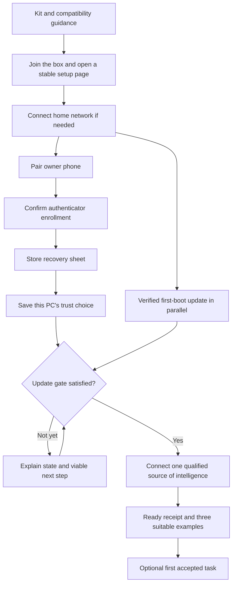

# Onboarding UX: from the kit to the first accepted task

Record: PR none · package UX4 · head e19274c36f7c2d81ad72d01b796aaa1eb36ba549

**Reviewed:** `e19274c36f7c2d81ad72d01b796aaa1eb36ba549`, 2026-10-08. **Scope:** the Owner Card, first boot, phone connection, pairing, authenticator enrollment, recovery sheet, host trust, model connection and first value. This is a separate, user-requested onboarding pass after [the broader UX review, PR #405](https://github.com/ghbmrk/agentOS/pull/405). It adds findings and acceptance detail rather than repeating that review's provider-start, network-repair, update-state and qualified-route findings.

**Recommendation:** keep the short guided setup and its existing security gates. Make every retry preserve the owner's choice, every app handoff have a clear return path, and completion mean the box can perform an identified useful task. Improving those boundaries increases capability access without adding routine confirmations or loosening authorization.

This is an advisory proposal to the primary lane. The project remains pre-alpha; production `agentos-localui` still has no setup hooks, explicitly pending P2-2w c4/localui L28. The runnable library flow reviewed here is not proof of a deployed owner journey. No runtime, SPEC, DECISIONS or authority policy changes are made by this intake.

## Evidence and best-practice basis

Source review covered the actual templates, state machine, card renderer, custody/enrollment assumptions, tests and queued integration. Synthetic public-interface probes rendered the current HTML and exercised failure/return paths. The browser independently inspected the fallback code page and host/privacy retry forms at 390 CSS pixels. [Portable evidence](evidence/2026-10-08-onboarding/README.md) distinguishes fake hooks from real rendering. Darwin's panic-only socket shims are never called. We did not test a real modem, phone OS, captive portal, authenticator, TPM, provider, printed QR or novice participant.

The guidance below informs design, not a claim of conformance or a reason to replace AgentOS's security contract:

| Primary source | Relevant principle | Application and boundary |
|---|---|---|
| [W3C: multi-page forms](https://www.w3.org/WAI/tutorials/forms/multi-page/) | Logical stages, understandable progress, identifiable optional work | Retain one screen per step; use stage-specific headings/titles. Do not turn mandatory enrollment into a skippable task or invent a percentage for update work. |
| [GOV.UK: error summary](https://design-system.service.gov.uk/components/error-summary/) | Make errors discoverable and associate them with the relevant input | Keep the active fallback open, identify the field and route focus predictably. Adapt the pattern to the existing script-restricted pages instead of importing a new framework. |
| [GOV.UK: check answers](https://design-system.service.gov.uk/patterns/check-answers/) | Let people inspect and correct choices without repeating the transaction | Show consequential choices near their existing submit action and in an optional summary. Do not add a compulsory confirmation screen or pretend an applied trust operation is a harmless form edit. |
| [W3C: redundant entry](https://www.w3.org/WAI/WCAG22/Understanding/redundant-entry.html) | Preserve valid information within a process; security and invalidated-data exceptions matter | Retain SSID and explicit opt-outs. Do not retain or redisplay authenticator seeds, API keys or expired codes to satisfy a blanket “save everything” rule. |
| [W3C: accessible authentication](https://www.w3.org/WAI/WCAG22/Understanding/accessible-authentication-minimum.html) and [NIST SP 800-63B-4, customer experience](https://pages.nist.gov/800-63-4/sp800-63b.html#customer-experience-considerations) | Reduce avoidable transcription, distinguish authenticators and evaluate realistic tasks | Preserve paste/autofill and a usable same-phone route. W3C's criterion primarily addresses existing-user authentication; applying its techniques during enrollment is design guidance, not proof of a WCAG violation here. Keep existing factors, retry limits and one-time seed disclosure. |
| [RFC 8628, device authorization](https://www.rfc-editor.org/rfc/rfc8628.html) | Pending, denial, expiry and polling limits are distinct protocol states | Extend UX3-1 with provider-authoritative state and scoped retry. Never invent expiry or restart a provider flow endlessly. |

## Priority findings

### UX4-1 — Retry can reverse a deliberate trust or privacy opt-out

**P1, release; reproduced.** The owner selects **This is not my PC**. `TrustHost(false)` fails. The returned page says “Could not save. Try again” but renders that checkbox unchecked; retrying the displayed default calls `TrustHost(true)`. Similarly, unchecking private-data permission and submitting a rejected API key calls `SetPrivateOK(false)`, then returns a checked permission box; retrying with the displayed default calls `SetPrivateOK(true)`. The synthetic key is correctly not echoed.

The network form has the same retention weakness: after submitting Synthetic Home and getting a join error, the selected SSID resets to the first option, Neighbor. These are source-template behaviors, not observations of a real host being trusted or private data leaving the box. [Host handler](https://github.com/ghbmrk/agentOS/blob/e19274c36f7c2d81ad72d01b796aaa1eb36ba549/broker/localui/setup.go#L881), [privacy before connection](https://github.com/ghbmrk/agentOS/blob/e19274c36f7c2d81ad72d01b796aaa1eb36ba549/broker/localui/setup.go#L914), [default controls](https://github.com/ghbmrk/agentOS/blob/e19274c36f7c2d81ad72d01b796aaa1eb36ba549/broker/localui/pages.go#L241).

Preserve attempted **non-secret choices** in the authorized setup context, distinguish requested from applied state, and reconcile a failed or ambiguous effect before presenting success. A retry must never widen authority merely because a template reapplies defaults. Keep secrets blank after failure, identify which secret must be re-entered, and preserve the selected provider/SSID. Initial normative defaults remain separate from an owner's later explicit choice. [Work item](../../briefs/UX4-1.md).

### UX4-2 — The fallback hides the very next step after sending a code

**P2, release; reproduced and browser-confirmed.** “Enter my number instead” sends a synthetic SMS. The response contains the confirmation form inside a closed `
` element. The browser shows the original primary path and “I sent it”, with no visible code field or confirmation that this fallback advanced. After a wrong code, the error is visible but the correction field is hidden again. Page titles remain “AgentOS”; error paragraphs are not associated with their fields. A send limit can also tell the owner to use **Text my box** when an invalid/unavailable box number means that link was not rendered.

Open the selected fallback after submission, show the masked destination and current next step, and keep the input available on an error. Use a specific title, a concise error summary/field relationship, and a next action actually available in the current state. Retain send/guess limits; rate-limit recovery must not send repeatedly, reveal another device's number or bypass proof of number possession. [Template](https://github.com/ghbmrk/agentOS/blob/e19274c36f7c2d81ad72d01b796aaa1eb36ba549/broker/localui/pages.go#L258), [fallback state](https://github.com/ghbmrk/agentOS/blob/e19274c36f7c2d81ad72d01b796aaa1eb36ba549/broker/localui/setup.go#L658). [Work item](../../briefs/UX4-2.md).

### UX4-3 — “Same phone” actually means the same browser context

**P2, release acceptance/design gate; synthetic context change reproduced.** After pairing, setup authority is bound to a cookie hash. Replacing the cookie while keeping the source address unchanged correctly yields “Setup is continuing on the phone that texted the box” and a recovery-sheet reset, with no ordinary resume action. That refusal protects enrollment. The wording and handoff plan do not explain that a captive-portal view and a full browser on the same physical phone may have different contexts. We did not measure which current phone versions share those contexts.

Qualify the supported captive/browser/app path and establish a stable setup browser **before pairing** when needed. Give explicit “return to this setup page” guidance and truthful “another browser session” copy. Same-context progress should resume without repeating enrollment. Any new transfer between contexts requires L1/security design: bind the contexts and current enrollment generation, limit lifetime/use, revoke the old authority at commit, and never regain seed access using SMS alone, AP membership or a cookie in a URL. Prefer making the existing safe path work before adding a new authentication mechanism. [Cookie and authority checks](https://github.com/ghbmrk/agentOS/blob/e19274c36f7c2d81ad72d01b796aaa1eb36ba549/broker/localui/setup.go#L294), [elsewhere page](https://github.com/ghbmrk/agentOS/blob/e19274c36f7c2d81ad72d01b796aaa1eb36ba549/broker/localui/pages.go#L275). [Work item](../../briefs/UX4-3.md).

### UX4-4 — Before the page opens, the owner has too little diagnostic guidance

**P2, release acceptance/spec gap; source-backed, hardware untested.** The card and guide say absent Wi-Fi means the PC did not boot the drive. Absence alone cannot distinguish that from a driver/AP/service failure. The card omits a separate branch for **Wi-Fi visible but cannot join**. WPA3 is the default, with an explicit WPA2 compatibility opt-in in APConfig, while localui L8 defers its owner-facing control to hardware work. A phone unable to join cannot use a page on that network to enable compatibility.

Create a tested pre-page decision tree: no SSID; SSID visible/join fails; joined/page absent; page present/uplink absent. State observed symptoms and bounded actions, not unsupported diagnoses. Freeze the supported PC/phone/network combinations and define the authorized pre-join compatibility path with L1 if necessary. Do not silently change all kits to WPA2, disable Secure Boot, mount host disks or replace the one-time boot menu with permanent firmware changes. Report true no-screen setup separately from a recovery path requiring a screen/keyboard. [Card wording](https://github.com/ghbmrk/agentOS/blob/e19274c36f7c2d81ad72d01b796aaa1eb36ba549/broker/card/render.go#L140), [AP compatibility seam](https://github.com/ghbmrk/agentOS/blob/e19274c36f7c2d81ad72d01b796aaa1eb36ba549/broker/localui/ap.go#L25), [existing hardware deferral L8](https://github.com/ghbmrk/agentOS/blob/e19274c36f7c2d81ad72d01b796aaa1eb36ba549/broker/localui/ASSUMPTIONS.md). [Work item](../../briefs/UX4-4.md).

### UX4-5 — Explain code replacement and recovery materials at the action

**P2, release; source-backed wording/state gap.** The first authenticator page says only the newest key works. The returned/shown page drops that warning and offers **Show a new key**. That button actually creates a replacement pending seed, invalidating the previous enrollment/confirmation; it is not a way to reveal the same key. The recovery acknowledgment is also less informative than the printed sheet: it omits that the key restores lost hardware or replaces a lost phone, and that it stays apart from the approval grid.

Call the action **Create replacement setup key**, with its consequence adjacent before activation; retain one-time disclosure and normal wrong-code retry against the same pending seed. Label the authenticator setup key, current approval code, pairing/page code and provider sign-in code by source and purpose. Give same-phone manual instructions only in fallback help; a second device must not become necessary. Reuse the printed recovery explanation and retain one meaningful storage acknowledgment—no quiz, photo upload, key retyping or forced backup service. [Code states](https://github.com/ghbmrk/agentOS/blob/e19274c36f7c2d81ad72d01b796aaa1eb36ba549/broker/localui/pages.go#L280), [replacement](https://github.com/ghbmrk/agentOS/blob/e19274c36f7c2d81ad72d01b796aaa1eb36ba549/broker/localui/setup.go#L829), [recovery purpose](https://github.com/ghbmrk/agentOS/blob/e19274c36f7c2d81ad72d01b796aaa1eb36ba549/broker/card/render.go#L170). [Work item](../../briefs/UX4-5.md).

### UX4-6 — Qualify the assembled journey through its first useful result

**P2, release acceptance extension; not a new runtime defect.** Direct POST tests can pass while visible controls prevent completion; the prior device-code finding demonstrates that. Hardware bring-up, HTTP fixtures and library tests are distinct evidence. A1 already requires multiple PCs, a novice, active minutes, typed characters and errors; A10 adds qualified local-only completion and accepted work. Extend that evidence through cross-app returns, one failure recovery, choices retained, STOP comprehension and a first accepted task. Reuse P2-2w c4, A1, H6 and INT-A rather than adding a separate framework or calling pending routes ready. [Work item and study protocol](../../briefs/UX4-6.md).

## Recommended onboarding flow

This is a proposed presentation of existing dependencies, not a new authority graph. Update/qualification gates remain authoritative. An optional first task is **after** required setup, and extra accounts, backup, boot PINs and advanced tuning stay optional.

Each step should answer: **what am I doing, why, what did the box save, and what happens next?** Use a short stage label, completed-stage status, one primary action, and contextual fallback/help. Do not imply arbitrary earlier stages can be edited: pairing, seed replacement and applied host trust require their existing privileged transitions. “Box ready” must be distinguishable from “setup complete” and “this task class available.” Show real completed stages and update states rather than a fabricated progress percentage or unmeasured wait estimate.

| Stage | Proposed owner-facing emphasis | Completion evidence / safe retry |
|---|---|---|
| Kit and boot | “Start from the drive; then join the Wi-Fi named on your card.” Help branches by what the owner sees. | Qualified hardware result; no blind repeated power cycling or Secure Boot downgrade. |
| Home network | “Connect the box to the internet.” Label home Wi-Fi separately from the box's Wi-Fi. | Broker confirms connection; keep selected network after failure, never echo its password from stored state. |
| Phone | “Text this pairing message, then return here.” Fallback becomes “Enter the code sent to …1234.” | Pairing confirmed in the authoritative state; stale code gives an actionable retry, not assumed success from opening Messages. |
| Authenticator | “Add AgentOS, return here, then enter its current 6-digit approval code.” | Real newest-seed confirmation; ordinary typo does not create a new key. Manual/paste route stays available on one phone. |
| Recovery | “Keep the sheet marked Recovery key. It restores the box or replaces a lost phone.” | One actual-storage acknowledgment; key remains off the box and apart from drive/grid. |
| This PC | Identify the actual PC and explain unattended unlock versus passphrase-plus-code next time. | Preserve the adopted trusted default, explicit opt-out and its retry state; show applied result accurately. |
| Intelligence | Qualified plan/API/hosted/local choices; explain capability, private-data permission and cost consequences. | A connected label is not qualification. Preserve route-specific defaults, custody and plan-only exhaustion behavior. |
| Ready | Show the saved PC choice, available task classes, owner contact and three suitable examples; optional safe first task. | Durable Finish/owner channel and usable qualified route. Do not show success merely because credentials were submitted. |

“Check answers” is best adapted as concise choice summaries at the existing decision and an optional setup summary, not an extra mandatory wizard. Changes to already applied host trust use the real authenticated operation. Do not promise a later settings route until it exists.

## Existing work to extend, not duplicate

| Existing owner | Onboarding-specific acceptance to add |
|---|---|
| [UX3-1 / PR #405](https://github.com/ghbmrk/agentOS/pull/405), P2-2w c4 | Visible provider start; real pending/denied/expired/error states; code explicitly labelled as the provider's; clear return to setup; retry changes only that provider flow. |
| UX3-2, P2-2w c3/c4 | Network repair after pairing must retain enrollment and authorization; distinguish home network from box AP. UX4-1 additionally covers pre-pairing input retention. |
| UX3-3, UPD-b2/c4 | Preserve verified-update gates while explaining waiting/error/fallback; continue permitted non-secret setup in parallel. |
| UX3-4, CAP-11-onb / D-051 / c4 | Offer supported qualified routes, including local-only. Untouched plan/hosted private-data submission must be false; the shared checked/Recommended template and old test expectation must not be carried into those route types. Do not change API-route policy by inference. Show plan exhaustion and fallback costs plainly. |
| UX3-11 | Apply contrast/reflow fixes to all setup steps, labels, errors, code inputs and long network/provider names; preserve full meaningful values. |
| P2-2w c2 r1, HOST-1b part 2 | Existing closed-enrollment and clock-readiness gaps stay with their current owners. Do not turn an unready clock into repeated instructions to fix a correct code or widen TOTP acceptance. |
| CH-21b, HOST-1c | Name/contact and host-impact guidance must match actual routes and hardware evidence. Avoid promising a phone handler or untouched-PC behavior without qualifying it. |

Later: hidden-network/manual-SSID support beyond the first-release supported network contract (UX4-L1). Current lack of that option is not automatically a release defect. The full task-list/dashboard pattern is unnecessary for this short sequence; reserve it for later optional configuration if testing justifies it.

## Measuring benefit without disguising a loss of power or protection

Use the [UX4-6 protocol](../../briefs/UX4-6.md) with realistic novice tasks and explicit supported device combinations. Record active owner time separately from waiting; completion and abandonment by stage; typed characters; app/context switches; resends; accidental key replacement; wrong-source codes; helper intervention; re-entry after failure; and time to an **accepted useful result**. Use synthetic secrets or redact recordings at entry. No new telemetry destination is authorized.

Security/capability pass conditions are simultaneous: explicit opt-outs survive every retry; no private route is enabled by a reset default; only the newest authorized enrollment works; transfer cannot widen setup authority; no secret enters logs or results; update and recovery gates remain; qualified routes still expose their supported task classes. Test STOP with models unavailable and preserve its existing behavior; a read-only preview or receipt does not earn effect authority.

Do not reduce prompts by hiding grants, discard recovery protection to improve conversion, force cloud intelligence to simplify routing, disable learning/parallelism by default, or require repeated approval where one already suffices. First establish these invariant checks, then compare owner effort against the unchanged flow. Freeze numerical A1 targets before qualification using observed baseline data; no completion-rate or time target is claimed achieved by this review.

## Decisions and delivery order

1. Fix UX4-1's authority-choice reversal and UX4-2's hidden next step alongside the existing provider-start defect.
2. Qualify the real phone/browser handoff; decide any new transfer authority before implementing UX4-3. Complete the supported-device/pre-join compatibility decision for UX4-4.
3. Improve factor/recovery instructions and ship the remaining setup hooks under their current owners. Preserve route-kind defaults and truthful progress.
4. Run the full onboarding-to-first-result protocol before claiming owner readiness.

Six [BOARD work items](../../BOARD.md#onboarding-ux-review-2026-10-08) carry bounded scopes and acceptance evidence; [LATER](../../LATER.md#onboarding-ux-review-intake-2026-10-08) records classification. None is claimed or implemented by this documentation PR. L1 remains responsible for new browser-transfer semantics, any compatibility policy change, or any departure from existing trust/recovery defaults.
